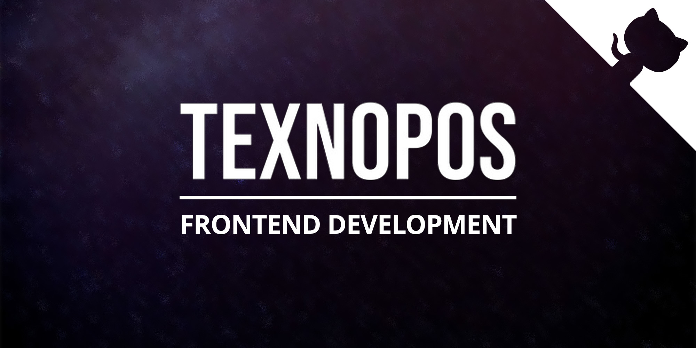

# TEXNOPOS - Frontend development

> 20+ open-source frontend programming projects. HTML, CSS, SASS, Tailwind CSS, Javascript and React technologies were used in the development of projects. The list contains links to demo versions of projects and figma models. Great for learning purpose!

_-Made by <a href="https://github.com/BekzhanovR" title="Bekzhanov Rasul">Bekzhanov Rasul</a>_

# Projects table

| Project name              | Demo version                                                     | Figma                                                                                                                                                                   | Tech Stack                     |
|---------------------------|------------------------------------------------------------------|-------------------------------------------------------------------------------------------------------------------------------------------------------------------------|--------------------------------|
| Course Egghead            | [website link](https://bekzhanovrasul.github.io/Course-EggHead/) | [Figma model](https://www.figma.com/design/6D89AomTtLr8vXTXqf5jJm/Course-Egghead--%C2%A0html%C2%A0css-template-for-course-(Community)?node-id=0-1&t=k6HNoChpKi52CB8r-0) | HTML, CSS                      |
| Portfolio webpage (Riead) | [website link](https://bekzhanovrasul.github.io/Riead/)          | [Figma model](https://www.figma.com/design/QLBtBOcUUDNq8BCO3o4Snx/Portfolio-Webpage-(Community)?node-id=0-1&t=U7KKFhGO94bKKWUt-0)                                       | HTML, CSS                      |
| DoctorCare                | [website link](https://bekzhanovrasul.github.io/DoctorCare/)     | [Figma model](https://www.figma.com/design/Bg2mHU1N8q3FbDy1notdUW/%D0%BC%D0%B5%D0%B4%D0%BF%D0%BE%D0%BC%D0%BE%D1%89%D1%8C?node-id=0-1&t=X5MkhyMRIYN0MrTu-0)              | HTML, CSS, JS, Responsivelity  |